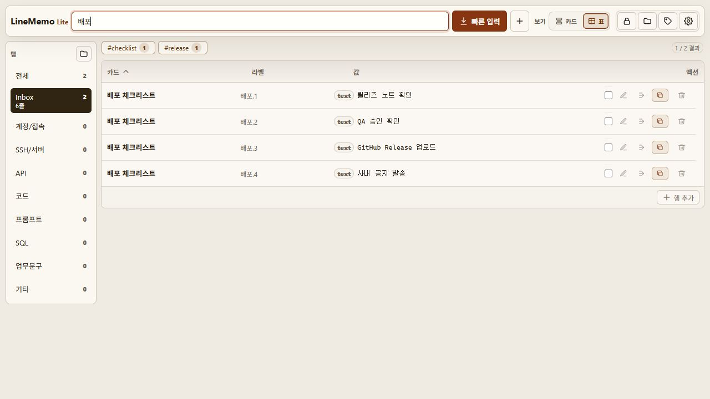

# LineMemo Lite

[](https://github.com/sungreong/LineMemo/actions/workflows/ci.yml)
[](LICENSE)

LineMemo Lite is a tiny Windows-first local copy launcher. It is designed for quickly saving repeated values, filtering by tab or tag, and copying a line without opening a heavy note app.



## Status

LineMemo Lite is a personal, Windows-first desktop app built with Tauri, vanilla JavaScript, and local JSON storage. It is intentionally small: no account system, no cloud sync, no telemetry, and no network service.

## Features

- Card, dense, and table views for different copy workflows
- Multi-tab filtering: use `All` for every card or combine several tabs at once
- Fast full-text search across card titles, descriptions, tab names, tags, labels, and values
- Korean-friendly search normalization, including composed/decomposed Hangul and IME composition handling
- Tag search with `#tag`, multiple tag OR filters such as `#api #server`, and clickable tag chips
- Tag suggestions in the card editor based on the selected tab and similar saved cards
- Tab manager with create, rename, delete, reorder, visibility filters, and usage counts
- Tag manager with search, rename, delete, card counts, and line counts
- Quick input panel that turns pasted lines into a new card
- New-card drafts are saved locally and can be restored after restarting the app
- Inline/table quick add for adding one line directly into the current view
- Card editor with paste parsing, line reorder/delete, divider support, labels, value types, and per-line validity dates
- One-click copy for a line, a card, a block between dividers, selected lines, or label-included output
- Right-click line menu for copy, edit, move, grouping, selection, and delete actions
- Multi-select copy bar that respects the current search and view order
- Favorite cards, card collapse/expand, and per-card line preview
- Per-line validity dates with optional expiry reminders
- Optional clipboard auto-clear after copying
- Optional save confirmation for changed card and line edits
- App screen lock with PBKDF2-hashed password, manual lock, and inactivity relock
- Duplicate value warning before adding the same value again, with a jump-to-existing option
- JSON backup export/import, CSV/TSV add import, import samples, and data path copy from settings
- Configurable data file location from Settings > Data
- Local-only storage with no cloud sync or telemetry

## Security Note

LineMemo Lite stores data as plain JSON on your PC. The app lock hides the interface, but data is not encrypted on disk. Do not store highly sensitive production credentials unless you accept that local plaintext risk.

Default data path:

```text
%APPDATA%\LineMemoLite\data.json
```

Users can move the active data file from Settings > Data by entering a folder or `.json` file path. The path pointer itself is stored under `%APPDATA%\LineMemoLite\storage.json`.

## Engineering Notes

- Korean search is treated as a first-class workflow: composed/decomposed Hangul and compatibility jamo are normalized before tokenization and ranking.
- Search combines MiniSearch with deterministic fallback scoring so exact card names, labels, tags, and line values stay discoverable even for short or Korean-heavy queries.
- Local data is normalized at the boundary, imported JSON is validated, and existing data files are backed up before destructive replacements.
- Secret values are hidden from transient copy feedback, hidden cell titles, lock screens, and expiry notifications.
- The Tauri shell keeps app behavior local and exposes only the commands and permissions needed for file I/O, clipboard, notifications, link opening, tray behavior, and autostart.
- Regression tests cover parsing, search, imports, shortcuts, copy behavior, app-lock hashing, renderer smoke checks, layout guards, and file-size budgets.

## Open Source License

This repository is licensed under the MIT License.

"Public source" means people can see the code. "Open source" means the license also gives them clear permission to use, copy, modify, and redistribute it. The `LICENSE` file is what makes that permission explicit.

## Install From A Local Build

Build artifacts are created by Tauri:

```text
src-tauri\target\release\linememo-lite.exe
src-tauri\target\release\bundle\nsis\LineMemo Lite_0.1.0_x64-setup.exe
src-tauri\target\release\bundle\msi\LineMemo Lite_0.1.0_x64_en-US.msi
```

The generated installers and release binaries are intentionally not committed to git. Publish them through GitHub Releases when needed.

## Data Import Format

Settings > Data supports two import paths:

- JSON backup files replace the current data after the app asks for confirmation.
- CSV/TSV files add new cards to the current list. For Excel, save the sheet as `CSV UTF-8` first.

CSV/TSV headers:

```text
tab,title,tags,description,label,value,type,secret,expiresAt,group
```

Example:

```csv
tab,title,tags,description,label,value,type,secret,expiresAt,group
프롬프트,문제 보고 공식,"문제보고, 프롬프트",반복 보고 문구,현재 문제,"현재 [문제]가 있습니다.",text,false,2026-12-31,보고세트
프롬프트,문제 보고 공식,"문제보고, 프롬프트",반복 보고 문구,요청,"[A안] 또는 [B안] 중 결정이 필요합니다.",text,false,2026-12-31,보고세트
```

`type` can be `text`, `url`, `command`, `code`, `image`, `divider`, or `note`. `expiresAt` uses `YYYY-MM-DD`; `group` is optional and links related lines into the same copy set. `secret` is kept for older backups and accepts `true`/`false`.

## Development Setup

Requirements:

- Windows
- Bun
- Rust/Cargo
- Microsoft Edge WebView2 Runtime

Install dependencies:

```powershell
bun install
```

Run tests:

```powershell
bun test
```

Run the web build:

```powershell
bun run build
```

Run the Tauri app in development:

```powershell
bun run tauri:dev
```

Build Windows packages:

```powershell
bun run tauri:build
```

If Cargo is installed but not available in the current PowerShell session:

```powershell
$env:PATH="$env:USERPROFILE\.cargo\bin;$env:PATH"
bun run tauri:build
```

## Project Structure

```text
src/                  Vanilla JS/CSS frontend
src/actions/          UI action handlers for tags, views, selection, and duplicates
src/state/            Active tab selection state helpers
src/ui/               Renderers, icons, editable-cell helpers
src/styles/           Split CSS modules under 1000 lines each
src-tauri/            Rust/Tauri app shell and local JSON I/O
```

## Quality Checks

The test suite includes regression checks for:

- Tag parsing and search behavior
- Korean search normalization regressions
- Renderer smoke tests
- Toolbar, modal, and row action layout guards
- Explicit button types to avoid accidental form submits
- JS/CSS file line budget under 1000 lines

## Keyboard Shortcuts

- `Ctrl+F`: focus search
- `Ctrl+N`: create a new card
- `Ctrl+Shift+N`: open quick input
- `Ctrl+Shift+A`: open table row add
- `Ctrl+Shift+L`: lock the app
- `Alt+1` / `Alt+2` / `Alt+3`: card, dense, table views
- `Ctrl+Enter`: submit the active form
- `Ctrl+S`: commit the active edit, otherwise save current data
- `Ctrl+C`: copy selected visible lines when a selection exists
- `Escape`: close the active editor or panel
